# aae-pytorch

Pytorch implementation of AAE

## Results

### Adversarial AutoEncorder

|MNIST|Encode|Decode|
|:---:|:---:|:---:|
|GaussianMixture|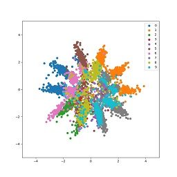|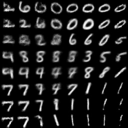|
|SwissRoll|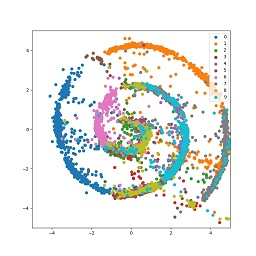|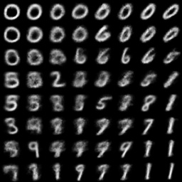|
|Normal|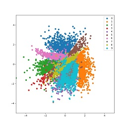|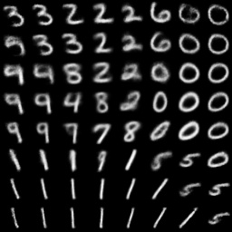|

### Incorporating Label Information

|MNIST|Encode|Decode|
|:---:|:---:|:---:|
|GaussianMixture|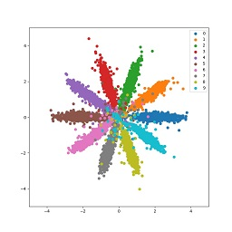|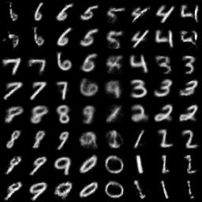|
|SwissRoll|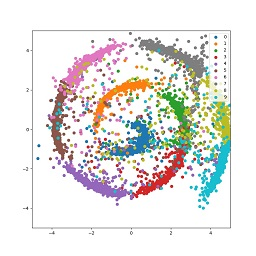|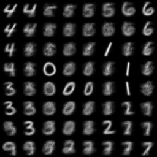|
|Normal|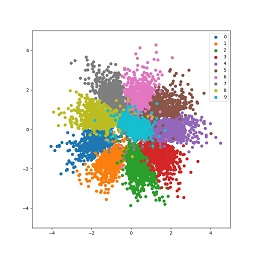|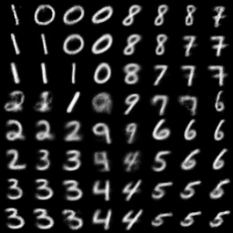|
